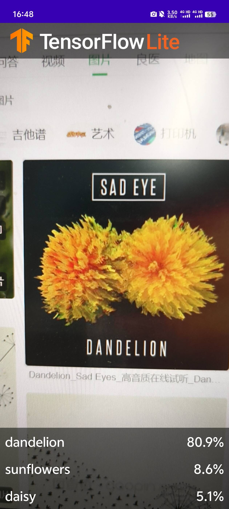

# 首先安装程序运行必备的一些库。


```python
!pip install tflite-model-maker
```

    Requirement already satisfied: tflite-model-maker in /workspaces/codespaces-jupyter/.conda/lib/python3.8/site-packages (0.4.3)
    Requirement already satisfied: tf-models-official==2.3.0 in /workspaces/codespaces-jupyter/.conda/lib/python3.8/site-packages (from tflite-model-maker) (2.3.0)
    Requirement already satisfied: numpy<1.23.4,>=1.17.3 in /workspaces/codespaces-jupyter/.conda/lib/python3.8/site-packages (from tflite-model-maker) (1.23.3)
    Requirement already satisfied: pillow>=7.0.0 in /workspaces/codespaces-jupyter/.conda/lib/python3.8/site-packages (from tflite-model-maker) (10.3.0)
    Requirement already satisfied: sentencepiece>=0.1.91 in /workspaces/codespaces-jupyter/.conda/lib/python3.8/site-packages (from tflite-model-maker) (0.2.0)
    Requirement already satisfied: tensorflow-datasets>=2.1.0 in /workspaces/codespaces-jupyter/.conda/lib/python3.8/site-packages (from tflite-model-maker) (4.9.0)
    Requirement already satisfied: fire>=0.3.1 in /workspaces/codespaces-jupyter/.conda/lib/python3.8/site-packages (from tflite-model-maker) (0.6.0)
    Requirement already satisfied: flatbuffers>=2.0 in /workspaces/codespaces-jupyter/.conda/lib/python3.8/site-packages (from tflite-model-maker) (24.3.25)
    Requirement already satisfied: absl-py>=0.10.0 in /workspaces/codespaces-jupyter/.conda/lib/python3.8/site-packages (from tflite-model-maker) (1.4.0)
    Requirement already satisfied: urllib3!=1.25.0,!=1.25.1,<1.26,>=1.21.1 in /workspaces/codespaces-jupyter/.conda/lib/python3.8/site-packages (from tflite-model-maker) (1.25.11)
    Requirement already satisfied: tflite-support>=0.4.2 in /workspaces/codespaces-jupyter/.conda/lib/python3.8/site-packages (from tflite-model-maker) (0.4.3)
    Requirement already satisfied: tensorflowjs<3.19.0,>=2.4.0 in /workspaces/codespaces-jupyter/.conda/lib/python3.8/site-packages (from tflite-model-maker) (3.18.0)
    Requirement already satisfied: tensorflow>=2.6.0 in /workspaces/codespaces-jupyter/.conda/lib/python3.8/site-packages (from tflite-model-maker) (2.8.4)
    Requirement already satisfied: numba>=0.53 in /workspaces/codespaces-jupyter/.conda/lib/python3.8/site-packages (from tflite-model-maker) (0.58.1)
    Requirement already satisfied: librosa==0.8.1 in /workspaces/codespaces-jupyter/.conda/lib/python3.8/site-packages (from tflite-model-maker) (0.8.1)
    Requirement already satisfied: lxml>=4.6.1 in /workspaces/codespaces-jupyter/.conda/lib/python3.8/site-packages (from tflite-model-maker) (5.2.2)
    Requirement already satisfied: PyYAML>=5.1 in /workspaces/codespaces-jupyter/.conda/lib/python3.8/site-packages (from tflite-model-maker) (6.0.1)
    Requirement already satisfied: matplotlib<3.5.0,>=3.0.3 in /workspaces/codespaces-jupyter/.conda/lib/python3.8/site-packages (from tflite-model-maker) (3.4.3)
    Requirement already satisfied: six>=1.12.0 in /workspaces/codespaces-jupyter/.conda/lib/python3.8/site-packages (from tflite-model-maker) (1.16.0)
    Requirement already satisfied: tensorflow-addons>=0.11.2 in /workspaces/codespaces-jupyter/.conda/lib/python3.8/site-packages (from tflite-model-maker) (0.21.0)
    Requirement already satisfied: neural-structured-learning>=1.3.1 in /workspaces/codespaces-jupyter/.conda/lib/python3.8/site-packages (from tflite-model-maker) (1.4.0)
    Requirement already satisfied: tensorflow-model-optimization>=0.5 in /workspaces/codespaces-jupyter/.conda/lib/python3.8/site-packages (from tflite-model-maker) (0.8.0)
    Requirement already satisfied: Cython>=0.29.13 in /workspaces/codespaces-jupyter/.conda/lib/python3.8/site-packages (from tflite-model-maker) (3.0.10)
    Requirement already satisfied: scann==1.2.6 in /workspaces/codespaces-jupyter/.conda/lib/python3.8/site-packages (from tflite-model-maker) (1.2.6)
    Requirement already satisfied: tensorflow-hub<0.13,>=0.7.0 in /workspaces/codespaces-jupyter/.conda/lib/python3.8/site-packages (from tflite-model-maker) (0.12.0)
    Requirement already satisfied: audioread>=2.0.0 in /workspaces/codespaces-jupyter/.conda/lib/python3.8/site-packages (from librosa==0.8.1->tflite-model-maker) (3.0.1)
    Requirement already satisfied: scipy>=1.0.0 in /workspaces/codespaces-jupyter/.conda/lib/python3.8/site-packages (from librosa==0.8.1->tflite-model-maker) (1.10.1)
    Requirement already satisfied: scikit-learn!=0.19.0,>=0.14.0 in /workspaces/codespaces-jupyter/.conda/lib/python3.8/site-packages (from librosa==0.8.1->tflite-model-maker) (1.3.2)
    Requirement already satisfied: joblib>=0.14 in /workspaces/codespaces-jupyter/.conda/lib/python3.8/site-packages (from librosa==0.8.1->tflite-model-maker) (1.4.2)
    Requirement already satisfied: decorator>=3.0.0 in /workspaces/codespaces-jupyter/.conda/lib/python3.8/site-packages (from librosa==0.8.1->tflite-model-maker) (5.1.1)
    Requirement already satisfied: resampy>=0.2.2 in /workspaces/codespaces-jupyter/.conda/lib/python3.8/site-packages (from librosa==0.8.1->tflite-model-maker) (0.4.3)
    Requirement already satisfied: soundfile>=0.10.2 in /workspaces/codespaces-jupyter/.conda/lib/python3.8/site-packages (from librosa==0.8.1->tflite-model-maker) (0.12.1)
    Requirement already satisfied: pooch>=1.0 in /workspaces/codespaces-jupyter/.conda/lib/python3.8/site-packages (from librosa==0.8.1->tflite-model-maker) (1.8.1)
    Requirement already satisfied: packaging>=20.0 in /workspaces/codespaces-jupyter/.conda/lib/python3.8/site-packages (from librosa==0.8.1->tflite-model-maker) (24.0)
    Requirement already satisfied: dataclasses in /workspaces/codespaces-jupyter/.conda/lib/python3.8/site-packages (from tf-models-official==2.3.0->tflite-model-maker) (0.6)
    Requirement already satisfied: gin-config in /workspaces/codespaces-jupyter/.conda/lib/python3.8/site-packages (from tf-models-official==2.3.0->tflite-model-maker) (0.5.0)
    Requirement already satisfied: google-api-python-client>=1.6.7 in /workspaces/codespaces-jupyter/.conda/lib/python3.8/site-packages (from tf-models-official==2.3.0->tflite-model-maker) (2.131.0)
    Requirement already satisfied: google-cloud-bigquery>=0.31.0 in /workspaces/codespaces-jupyter/.conda/lib/python3.8/site-packages (from tf-models-official==2.3.0->tflite-model-maker) (3.23.1)
    Requirement already satisfied: kaggle>=1.3.9 in /workspaces/codespaces-jupyter/.conda/lib/python3.8/site-packages (from tf-models-official==2.3.0->tflite-model-maker) (1.6.14)
    Requirement already satisfied: opencv-python-headless in /workspaces/codespaces-jupyter/.conda/lib/python3.8/site-packages (from tf-models-official==2.3.0->tflite-model-maker) (4.9.0.80)
    Requirement already satisfied: pandas>=0.22.0 in /workspaces/codespaces-jupyter/.conda/lib/python3.8/site-packages (from tf-models-official==2.3.0->tflite-model-maker) (2.0.3)
    Requirement already satisfied: psutil>=5.4.3 in /workspaces/codespaces-jupyter/.conda/lib/python3.8/site-packages (from tf-models-official==2.3.0->tflite-model-maker) (5.9.8)
    Requirement already satisfied: py-cpuinfo>=3.3.0 in /workspaces/codespaces-jupyter/.conda/lib/python3.8/site-packages (from tf-models-official==2.3.0->tflite-model-maker) (9.0.0)
    Requirement already satisfied: tf-slim>=1.1.0 in /workspaces/codespaces-jupyter/.conda/lib/python3.8/site-packages (from tf-models-official==2.3.0->tflite-model-maker) (1.1.0)
    Requirement already satisfied: termcolor in /workspaces/codespaces-jupyter/.conda/lib/python3.8/site-packages (from fire>=0.3.1->tflite-model-maker) (2.4.0)
    Requirement already satisfied: cycler>=0.10 in /workspaces/codespaces-jupyter/.conda/lib/python3.8/site-packages (from matplotlib<3.5.0,>=3.0.3->tflite-model-maker) (0.12.1)
    Requirement already satisfied: kiwisolver>=1.0.1 in /workspaces/codespaces-jupyter/.conda/lib/python3.8/site-packages (from matplotlib<3.5.0,>=3.0.3->tflite-model-maker) (1.4.5)
    Requirement already satisfied: pyparsing>=2.2.1 in /workspaces/codespaces-jupyter/.conda/lib/python3.8/site-packages (from matplotlib<3.5.0,>=3.0.3->tflite-model-maker) (3.1.2)
    Requirement already satisfied: python-dateutil>=2.7 in /workspaces/codespaces-jupyter/.conda/lib/python3.8/site-packages (from matplotlib<3.5.0,>=3.0.3->tflite-model-maker) (2.9.0)
    Requirement already satisfied: attrs in /workspaces/codespaces-jupyter/.conda/lib/python3.8/site-packages (from neural-structured-learning>=1.3.1->tflite-model-maker) (23.2.0)
    Requirement already satisfied: llvmlite<0.42,>=0.41.0dev0 in /workspaces/codespaces-jupyter/.conda/lib/python3.8/site-packages (from numba>=0.53->tflite-model-maker) (0.41.1)
    Requirement already satisfied: importlib-metadata in /workspaces/codespaces-jupyter/.conda/lib/python3.8/site-packages (from numba>=0.53->tflite-model-maker) (7.1.0)
    Requirement already satisfied: astunparse>=1.6.0 in /workspaces/codespaces-jupyter/.conda/lib/python3.8/site-packages (from tensorflow>=2.6.0->tflite-model-maker) (1.6.3)
    Requirement already satisfied: gast>=0.2.1 in /workspaces/codespaces-jupyter/.conda/lib/python3.8/site-packages (from tensorflow>=2.6.0->tflite-model-maker) (0.5.4)
    Requirement already satisfied: google-pasta>=0.1.1 in /workspaces/codespaces-jupyter/.conda/lib/python3.8/site-packages (from tensorflow>=2.6.0->tflite-model-maker) (0.2.0)
    Requirement already satisfied: h5py>=2.9.0 in /workspaces/codespaces-jupyter/.conda/lib/python3.8/site-packages (from tensorflow>=2.6.0->tflite-model-maker) (3.11.0)
    Requirement already satisfied: keras-preprocessing>=1.1.1 in /workspaces/codespaces-jupyter/.conda/lib/python3.8/site-packages (from tensorflow>=2.6.0->tflite-model-maker) (1.1.2)
    Requirement already satisfied: libclang>=9.0.1 in /workspaces/codespaces-jupyter/.conda/lib/python3.8/site-packages (from tensorflow>=2.6.0->tflite-model-maker) (18.1.1)
    Requirement already satisfied: opt-einsum>=2.3.2 in /workspaces/codespaces-jupyter/.conda/lib/python3.8/site-packages (from tensorflow>=2.6.0->tflite-model-maker) (3.3.0)
    Requirement already satisfied: protobuf<3.20,>=3.9.2 in /workspaces/codespaces-jupyter/.conda/lib/python3.8/site-packages (from tensorflow>=2.6.0->tflite-model-maker) (3.19.6)
    Requirement already satisfied: setuptools in /workspaces/codespaces-jupyter/.conda/lib/python3.8/site-packages (from tensorflow>=2.6.0->tflite-model-maker) (69.5.1)
    Requirement already satisfied: typing-extensions>=3.6.6 in /workspaces/codespaces-jupyter/.conda/lib/python3.8/site-packages (from tensorflow>=2.6.0->tflite-model-maker) (4.11.0)
    Requirement already satisfied: wrapt>=1.11.0 in /workspaces/codespaces-jupyter/.conda/lib/python3.8/site-packages (from tensorflow>=2.6.0->tflite-model-maker) (1.16.0)
    Requirement already satisfied: tensorboard<2.9,>=2.8 in /workspaces/codespaces-jupyter/.conda/lib/python3.8/site-packages (from tensorflow>=2.6.0->tflite-model-maker) (2.8.0)
    Requirement already satisfied: tensorflow-estimator<2.9,>=2.8 in /workspaces/codespaces-jupyter/.conda/lib/python3.8/site-packages (from tensorflow>=2.6.0->tflite-model-maker) (2.8.0)
    Requirement already satisfied: keras<2.9,>=2.8.0rc0 in /workspaces/codespaces-jupyter/.conda/lib/python3.8/site-packages (from tensorflow>=2.6.0->tflite-model-maker) (2.8.0)
    Requirement already satisfied: tensorflow-io-gcs-filesystem>=0.23.1 in /workspaces/codespaces-jupyter/.conda/lib/python3.8/site-packages (from tensorflow>=2.6.0->tflite-model-maker) (0.34.0)
    Requirement already satisfied: grpcio<2.0,>=1.24.3 in /workspaces/codespaces-jupyter/.conda/lib/python3.8/site-packages (from tensorflow>=2.6.0->tflite-model-maker) (1.64.0)
    Requirement already satisfied: typeguard<3.0.0,>=2.7 in /workspaces/codespaces-jupyter/.conda/lib/python3.8/site-packages (from tensorflow-addons>=0.11.2->tflite-model-maker) (2.13.3)
    Requirement already satisfied: array-record in /workspaces/codespaces-jupyter/.conda/lib/python3.8/site-packages (from tensorflow-datasets>=2.1.0->tflite-model-maker) (0.4.0)
    Requirement already satisfied: click in /workspaces/codespaces-jupyter/.conda/lib/python3.8/site-packages (from tensorflow-datasets>=2.1.0->tflite-model-maker) (8.1.7)
    Requirement already satisfied: dm-tree in /workspaces/codespaces-jupyter/.conda/lib/python3.8/site-packages (from tensorflow-datasets>=2.1.0->tflite-model-maker) (0.1.8)
    Requirement already satisfied: etils>=0.9.0 in /workspaces/codespaces-jupyter/.conda/lib/python3.8/site-packages (from etils[enp,epath]>=0.9.0->tensorflow-datasets>=2.1.0->tflite-model-maker) (1.3.0)
    Requirement already satisfied: promise in /workspaces/codespaces-jupyter/.conda/lib/python3.8/site-packages (from tensorflow-datasets>=2.1.0->tflite-model-maker) (2.3)
    Requirement already satisfied: requests>=2.19.0 in /workspaces/codespaces-jupyter/.conda/lib/python3.8/site-packages (from tensorflow-datasets>=2.1.0->tflite-model-maker) (2.32.3)
    Requirement already satisfied: tensorflow-metadata in /workspaces/codespaces-jupyter/.conda/lib/python3.8/site-packages (from tensorflow-datasets>=2.1.0->tflite-model-maker) (1.13.0)
    Requirement already satisfied: toml in /workspaces/codespaces-jupyter/.conda/lib/python3.8/site-packages (from tensorflow-datasets>=2.1.0->tflite-model-maker) (0.10.2)
    Requirement already satisfied: tqdm in /workspaces/codespaces-jupyter/.conda/lib/python3.8/site-packages (from tensorflow-datasets>=2.1.0->tflite-model-maker) (4.66.4)
    Requirement already satisfied: importlib-resources in /workspaces/codespaces-jupyter/.conda/lib/python3.8/site-packages (from tensorflow-datasets>=2.1.0->tflite-model-maker) (6.4.0)
    Collecting packaging>=20.0 (from librosa==0.8.1->tflite-model-maker)
      Using cached packaging-20.9-py2.py3-none-any.whl.metadata (13 kB)
    Requirement already satisfied: sounddevice>=0.4.4 in /workspaces/codespaces-jupyter/.conda/lib/python3.8/site-packages (from tflite-support>=0.4.2->tflite-model-maker) (0.4.7)
    Requirement already satisfied: pybind11>=2.6.0 in /workspaces/codespaces-jupyter/.conda/lib/python3.8/site-packages (from tflite-support>=0.4.2->tflite-model-maker) (2.12.0)
    Requirement already satisfied: wheel<1.0,>=0.23.0 in /workspaces/codespaces-jupyter/.conda/lib/python3.8/site-packages (from astunparse>=1.6.0->tensorflow>=2.6.0->tflite-model-maker) (0.43.0)
    Requirement already satisfied: zipp in /workspaces/codespaces-jupyter/.conda/lib/python3.8/site-packages (from etils[enp,epath]>=0.9.0->tensorflow-datasets>=2.1.0->tflite-model-maker) (3.17.0)
    Requirement already satisfied: httplib2<1.dev0,>=0.19.0 in /workspaces/codespaces-jupyter/.conda/lib/python3.8/site-packages (from google-api-python-client>=1.6.7->tf-models-official==2.3.0->tflite-model-maker) (0.22.0)
    Requirement already satisfied: google-auth!=2.24.0,!=2.25.0,<3.0.0.dev0,>=1.32.0 in /workspaces/codespaces-jupyter/.conda/lib/python3.8/site-packages (from google-api-python-client>=1.6.7->tf-models-official==2.3.0->tflite-model-maker) (2.29.0)
    Requirement already satisfied: google-auth-httplib2<1.0.0,>=0.2.0 in /workspaces/codespaces-jupyter/.conda/lib/python3.8/site-packages (from google-api-python-client>=1.6.7->tf-models-official==2.3.0->tflite-model-maker) (0.2.0)
    Requirement already satisfied: google-api-core!=2.0.*,!=2.1.*,!=2.2.*,!=2.3.0,<3.0.0.dev0,>=1.31.5 in /workspaces/codespaces-jupyter/.conda/lib/python3.8/site-packages (from google-api-python-client>=1.6.7->tf-models-official==2.3.0->tflite-model-maker) (2.19.0)
    Requirement already satisfied: uritemplate<5,>=3.0.1 in /workspaces/codespaces-jupyter/.conda/lib/python3.8/site-packages (from google-api-python-client>=1.6.7->tf-models-official==2.3.0->tflite-model-maker) (4.1.1)
    Requirement already satisfied: google-cloud-core<3.0.0dev,>=1.6.0 in /workspaces/codespaces-jupyter/.conda/lib/python3.8/site-packages (from google-cloud-bigquery>=0.31.0->tf-models-official==2.3.0->tflite-model-maker) (2.4.1)
    Requirement already satisfied: google-resumable-media<3.0dev,>=0.6.0 in /workspaces/codespaces-jupyter/.conda/lib/python3.8/site-packages (from google-cloud-bigquery>=0.31.0->tf-models-official==2.3.0->tflite-model-maker) (2.7.0)
    Requirement already satisfied: certifi>=2023.7.22 in /workspaces/codespaces-jupyter/.conda/lib/python3.8/site-packages (from kaggle>=1.3.9->tf-models-official==2.3.0->tflite-model-maker) (2024.2.2)
    Requirement already satisfied: python-slugify in /workspaces/codespaces-jupyter/.conda/lib/python3.8/site-packages (from kaggle>=1.3.9->tf-models-official==2.3.0->tflite-model-maker) (8.0.4)
    Requirement already satisfied: bleach in /workspaces/codespaces-jupyter/.conda/lib/python3.8/site-packages (from kaggle>=1.3.9->tf-models-official==2.3.0->tflite-model-maker) (6.1.0)
    Requirement already satisfied: pytz>=2020.1 in /workspaces/codespaces-jupyter/.conda/lib/python3.8/site-packages (from pandas>=0.22.0->tf-models-official==2.3.0->tflite-model-maker) (2024.1)
    Requirement already satisfied: tzdata>=2022.1 in /workspaces/codespaces-jupyter/.conda/lib/python3.8/site-packages (from pandas>=0.22.0->tf-models-official==2.3.0->tflite-model-maker) (2024.1)
    Requirement already satisfied: platformdirs>=2.5.0 in /workspaces/codespaces-jupyter/.conda/lib/python3.8/site-packages (from pooch>=1.0->librosa==0.8.1->tflite-model-maker) (4.2.2)
    Requirement already satisfied: charset-normalizer<4,>=2 in /workspaces/codespaces-jupyter/.conda/lib/python3.8/site-packages (from requests>=2.19.0->tensorflow-datasets>=2.1.0->tflite-model-maker) (3.3.2)
    Requirement already satisfied: idna<4,>=2.5 in /workspaces/codespaces-jupyter/.conda/lib/python3.8/site-packages (from requests>=2.19.0->tensorflow-datasets>=2.1.0->tflite-model-maker) (3.7)
    Requirement already satisfied: threadpoolctl>=2.0.0 in /workspaces/codespaces-jupyter/.conda/lib/python3.8/site-packages (from scikit-learn!=0.19.0,>=0.14.0->librosa==0.8.1->tflite-model-maker) (3.5.0)
    Requirement already satisfied: CFFI>=1.0 in /workspaces/codespaces-jupyter/.conda/lib/python3.8/site-packages (from sounddevice>=0.4.4->tflite-support>=0.4.2->tflite-model-maker) (1.16.0)
    Requirement already satisfied: google-auth-oauthlib<0.5,>=0.4.1 in /workspaces/codespaces-jupyter/.conda/lib/python3.8/site-packages (from tensorboard<2.9,>=2.8->tensorflow>=2.6.0->tflite-model-maker) (0.4.6)
    Requirement already satisfied: markdown>=2.6.8 in /workspaces/codespaces-jupyter/.conda/lib/python3.8/site-packages (from tensorboard<2.9,>=2.8->tensorflow>=2.6.0->tflite-model-maker) (3.6)
    Requirement already satisfied: tensorboard-data-server<0.7.0,>=0.6.0 in /workspaces/codespaces-jupyter/.conda/lib/python3.8/site-packages (from tensorboard<2.9,>=2.8->tensorflow>=2.6.0->tflite-model-maker) (0.6.1)
    Requirement already satisfied: tensorboard-plugin-wit>=1.6.0 in /workspaces/codespaces-jupyter/.conda/lib/python3.8/site-packages (from tensorboard<2.9,>=2.8->tensorflow>=2.6.0->tflite-model-maker) (1.8.1)
    Requirement already satisfied: werkzeug>=0.11.15 in /workspaces/codespaces-jupyter/.conda/lib/python3.8/site-packages (from tensorboard<2.9,>=2.8->tensorflow>=2.6.0->tflite-model-maker) (3.0.3)
    Requirement already satisfied: googleapis-common-protos<2,>=1.52.0 in /workspaces/codespaces-jupyter/.conda/lib/python3.8/site-packages (from tensorflow-metadata->tensorflow-datasets>=2.1.0->tflite-model-maker) (1.63.0)
    Requirement already satisfied: pycparser in /workspaces/codespaces-jupyter/.conda/lib/python3.8/site-packages (from CFFI>=1.0->sounddevice>=0.4.4->tflite-support>=0.4.2->tflite-model-maker) (2.22)
    Requirement already satisfied: proto-plus<2.0.0dev,>=1.22.3 in /workspaces/codespaces-jupyter/.conda/lib/python3.8/site-packages (from google-api-core!=2.0.*,!=2.1.*,!=2.2.*,!=2.3.0,<3.0.0.dev0,>=1.31.5->google-api-python-client>=1.6.7->tf-models-official==2.3.0->tflite-model-maker) (1.23.0)
    Requirement already satisfied: grpcio-status<2.0.dev0,>=1.33.2 in /workspaces/codespaces-jupyter/.conda/lib/python3.8/site-packages (from google-api-core[grpc]!=2.0.*,!=2.1.*,!=2.10.*,!=2.2.*,!=2.3.*,!=2.4.*,!=2.5.*,!=2.6.*,!=2.7.*,!=2.8.*,!=2.9.*,<3.0.0dev,>=1.34.1->google-cloud-bigquery>=0.31.0->tf-models-official==2.3.0->tflite-model-maker) (1.48.2)
    Requirement already satisfied: cachetools<6.0,>=2.0.0 in /workspaces/codespaces-jupyter/.conda/lib/python3.8/site-packages (from google-auth!=2.24.0,!=2.25.0,<3.0.0.dev0,>=1.32.0->google-api-python-client>=1.6.7->tf-models-official==2.3.0->tflite-model-maker) (5.3.3)
    Requirement already satisfied: pyasn1-modules>=0.2.1 in /workspaces/codespaces-jupyter/.conda/lib/python3.8/site-packages (from google-auth!=2.24.0,!=2.25.0,<3.0.0.dev0,>=1.32.0->google-api-python-client>=1.6.7->tf-models-official==2.3.0->tflite-model-maker) (0.4.0)
    Requirement already satisfied: rsa<5,>=3.1.4 in /workspaces/codespaces-jupyter/.conda/lib/python3.8/site-packages (from google-auth!=2.24.0,!=2.25.0,<3.0.0.dev0,>=1.32.0->google-api-python-client>=1.6.7->tf-models-official==2.3.0->tflite-model-maker) (4.9)
    Requirement already satisfied: requests-oauthlib>=0.7.0 in /workspaces/codespaces-jupyter/.conda/lib/python3.8/site-packages (from google-auth-oauthlib<0.5,>=0.4.1->tensorboard<2.9,>=2.8->tensorflow>=2.6.0->tflite-model-maker) (2.0.0)
    Requirement already satisfied: google-crc32c<2.0dev,>=1.0 in /workspaces/codespaces-jupyter/.conda/lib/python3.8/site-packages (from google-resumable-media<3.0dev,>=0.6.0->google-cloud-bigquery>=0.31.0->tf-models-official==2.3.0->tflite-model-maker) (1.5.0)
    Requirement already satisfied: MarkupSafe>=2.1.1 in /workspaces/codespaces-jupyter/.conda/lib/python3.8/site-packages (from werkzeug>=0.11.15->tensorboard<2.9,>=2.8->tensorflow>=2.6.0->tflite-model-maker) (2.1.5)
    Requirement already satisfied: webencodings in /workspaces/codespaces-jupyter/.conda/lib/python3.8/site-packages (from bleach->kaggle>=1.3.9->tf-models-official==2.3.0->tflite-model-maker) (0.5.1)
    Requirement already satisfied: text-unidecode>=1.3 in /workspaces/codespaces-jupyter/.conda/lib/python3.8/site-packages (from python-slugify->kaggle>=1.3.9->tf-models-official==2.3.0->tflite-model-maker) (1.3)
    Requirement already satisfied: pyasn1<0.7.0,>=0.4.6 in /workspaces/codespaces-jupyter/.conda/lib/python3.8/site-packages (from pyasn1-modules>=0.2.1->google-auth!=2.24.0,!=2.25.0,<3.0.0.dev0,>=1.32.0->google-api-python-client>=1.6.7->tf-models-official==2.3.0->tflite-model-maker) (0.6.0)
    Requirement already satisfied: oauthlib>=3.0.0 in /workspaces/codespaces-jupyter/.conda/lib/python3.8/site-packages (from requests-oauthlib>=0.7.0->google-auth-oauthlib<0.5,>=0.4.1->tensorboard<2.9,>=2.8->tensorflow>=2.6.0->tflite-model-maker) (3.2.2)
    Using cached packaging-20.9-py2.py3-none-any.whl (40 kB)
    Installing collected packages: packaging
      Attempting uninstall: packaging
        Found existing installation: packaging 24.0
        Uninstalling packaging-24.0:
          Successfully uninstalled packaging-24.0
    ERROR: pip's dependency resolver does not currently take into account all the packages that are installed. This behaviour is the source of the following dependency conflicts.
    pkg-about 1.1.5 requires packaging>=23.2.0, but you have packaging 20.9 which is incompatible.
    Successfully installed packaging-20.9


# 接下来，导入相关的库。


```python
import os

import numpy as np

import tensorflow as tf
assert tf.__version__.startswith('2')

from tflite_model_maker import model_spec
from tflite_model_maker import image_classifier
from tflite_model_maker.config import ExportFormat
from tflite_model_maker.config import QuantizationConfig
from tflite_model_maker.image_classifier import DataLoader

import matplotlib.pyplot as plt

```

## 没有报错则进行下一步
# 模型训练
## 获取数据


```python
image_path = tf.keras.utils.get_file(
      'flower_photos.tgz',
      'https://storage.googleapis.com/download.tensorflow.org/example_images/flower_photos.tgz',
      extract=True)
image_path = os.path.join(os.path.dirname(image_path), 'flower_photos')

```

    Downloading data from https://storage.googleapis.com/download.tensorflow.org/example_images/flower_photos.tgz
    228818944/228813984 [==============================] - 11s 0us/step
    228827136/228813984 [==============================] - 11s 0us/step


## 第一步：加载数据集，并将数据集分为训练数据和测试数据。


```python
data = DataLoader.from_folder(image_path)
train_data, test_data = data.split(0.9)
```

    INFO:tensorflow:Load image with size: 3670, num_label: 5, labels: daisy, dandelion, roses, sunflowers, tulips.


    2024-05-31 08:33:06.325128: W tensorflow/stream_executor/platform/default/dso_loader.cc:64] Could not load dynamic library 'libcuda.so.1'; dlerror: libcuda.so.1: cannot open shared object file: No such file or directory; LD_LIBRARY_PATH: /workspaces/codespaces-jupyter/.conda/lib/python3.8/site-packages/cv2/../../lib64:
    2024-05-31 08:33:06.325157: W tensorflow/stream_executor/cuda/cuda_driver.cc:269] failed call to cuInit: UNKNOWN ERROR (303)
    2024-05-31 08:33:06.325178: I tensorflow/stream_executor/cuda/cuda_diagnostics.cc:156] kernel driver does not appear to be running on this host (codespaces-edbecf): /proc/driver/nvidia/version does not exist
    2024-05-31 08:33:06.325475: I tensorflow/core/platform/cpu_feature_guard.cc:151] This TensorFlow binary is optimized with oneAPI Deep Neural Network Library (oneDNN) to use the following CPU instructions in performance-critical operations:  AVX2 FMA
    To enable them in other operations, rebuild TensorFlow with the appropriate compiler flags.


## 第二步：训练Tensorflow模型


```python
model = image_classifier.create(train_data)
```

    INFO:tensorflow:Retraining the models...
    Model: "sequential"
    _________________________________________________________________
     Layer (type)                Output Shape              Param #   
    =================================================================
     hub_keras_layer_v1v2 (HubKe  (None, 1280)             3413024   
     rasLayerV1V2)                                                   
                                                                     
     dropout (Dropout)           (None, 1280)              0         
                                                                     
     dense (Dense)               (None, 5)                 6405      
                                                                     
    =================================================================
    Total params: 3,419,429
    Trainable params: 6,405
    Non-trainable params: 3,413,024
    _________________________________________________________________
    None
    Epoch 1/5


    2024-05-31 08:33:21.107140: W tensorflow/core/framework/cpu_allocator_impl.cc:82] Allocation of 51380224 exceeds 10% of free system memory.
    2024-05-31 08:33:21.207280: W tensorflow/core/framework/cpu_allocator_impl.cc:82] Allocation of 51380224 exceeds 10% of free system memory.
    2024-05-31 08:33:21.262749: W tensorflow/core/framework/cpu_allocator_impl.cc:82] Allocation of 51380224 exceeds 10% of free system memory.
    2024-05-31 08:33:21.326079: W tensorflow/core/framework/cpu_allocator_impl.cc:82] Allocation of 154140672 exceeds 10% of free system memory.
    2024-05-31 08:33:21.403963: W tensorflow/core/framework/cpu_allocator_impl.cc:82] Allocation of 57802752 exceeds 10% of free system memory.


    103/103 [==============================] - 51s 479ms/step - loss: 0.8570 - accuracy: 0.7673
    Epoch 2/5
    103/103 [==============================] - 51s 499ms/step - loss: 0.6501 - accuracy: 0.8987
    Epoch 3/5
    103/103 [==============================] - 47s 456ms/step - loss: 0.6179 - accuracy: 0.9175
    Epoch 4/5
    103/103 [==============================] - 52s 502ms/step - loss: 0.6023 - accuracy: 0.9263
    Epoch 5/5
    103/103 [==============================] - 54s 525ms/step - loss: 0.5833 - accuracy: 0.9360


## 第三步：评估模型


```python
loss, accuracy = model.evaluate(test_data)
```

    12/12 [==============================] - 7s 412ms/step - loss: 0.6121 - accuracy: 0.9046


## 第四步，导出Tensorflow Lite模型


```python
model.export(export_dir='.')
```

    2024-05-31 08:38:13.250815: W tensorflow/python/util/util.cc:368] Sets are not currently considered sequences, but this may change in the future, so consider avoiding using them.


    INFO:tensorflow:Assets written to: /tmp/tmpkaq5tz39/assets


    INFO:tensorflow:Assets written to: /tmp/tmpkaq5tz39/assets
    2024-05-31 08:38:16.977665: I tensorflow/core/grappler/devices.cc:66] Number of eligible GPUs (core count >= 8, compute capability >= 0.0): 0
    2024-05-31 08:38:16.977813: I tensorflow/core/grappler/clusters/single_machine.cc:358] Starting new session
    2024-05-31 08:38:17.004038: I tensorflow/core/grappler/optimizers/meta_optimizer.cc:1164] Optimization results for grappler item: graph_to_optimize
      function_optimizer: Graph size after: 913 nodes (656), 923 edges (664), time = 14.768ms.
      function_optimizer: function_optimizer did nothing. time = 0.005ms.
    
    /workspaces/codespaces-jupyter/.conda/lib/python3.8/site-packages/tensorflow/lite/python/convert.py:746: UserWarning: Statistics for quantized inputs were expected, but not specified; continuing anyway.
      warnings.warn("Statistics for quantized inputs were expected, but not "
    2024-05-31 08:38:17.548177: W tensorflow/compiler/mlir/lite/python/tf_tfl_flatbuffer_helpers.cc:357] Ignored output_format.
    2024-05-31 08:38:17.548224: W tensorflow/compiler/mlir/lite/python/tf_tfl_flatbuffer_helpers.cc:360] Ignored drop_control_dependency.


    INFO:tensorflow:Label file is inside the TFLite model with metadata.


    fully_quantize: 0, inference_type: 6, input_inference_type: 3, output_inference_type: 3
    INFO:tensorflow:Label file is inside the TFLite model with metadata.


    INFO:tensorflow:Saving labels in /tmp/tmpqu6gc_6i/labels.txt


    INFO:tensorflow:Saving labels in /tmp/tmpqu6gc_6i/labels.txt


    INFO:tensorflow:TensorFlow Lite model exported successfully: ./model.tflite


    INFO:tensorflow:TensorFlow Lite model exported successfully: ./model.tflite


# 将导出的 model.tflite 替换 TFLClassify 中的 FlowerModel.tflite
## 训练后在手机中调试



