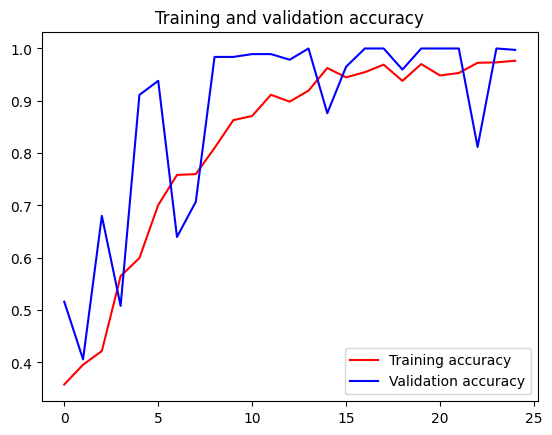

### 首先下载石头剪刀布的训练集和测试集：


```python
!wget --no-check-certificate https://storage.googleapis.com/learning-datasets/rps.zip -O ../data/rps.zip
!wget --no-check-certificate https://storage.googleapis.com/learning-datasets/rps-test-set.zip -O ../data/rps-test-set.zip
```

    --2024-06-07 06:59:26--  https://storage.googleapis.com/learning-datasets/rps.zip
    Resolving storage.googleapis.com (storage.googleapis.com)... 74.125.130.207, 74.125.68.207, 64.233.170.207, ...
    Connecting to storage.googleapis.com (storage.googleapis.com)|74.125.130.207|:443... connected.
    HTTP request sent, awaiting response... 200 OK
    Length: 200682221 (191M) [application/zip]
    Saving to: ‘../data/rps.zip’
    
    ../data/rps.zip     100%[===================>] 191.38M  18.6MB/s    in 13s     
    
    2024-06-07 06:59:39 (14.5 MB/s) - ‘../data/rps.zip’ saved [200682221/200682221]
    
    --2024-06-07 06:59:40--  https://storage.googleapis.com/learning-datasets/rps-test-set.zip
    Resolving storage.googleapis.com (storage.googleapis.com)... 142.251.10.207, 64.233.170.207, 74.125.68.207, ...
    Connecting to storage.googleapis.com (storage.googleapis.com)|142.251.10.207|:443... connected.
    HTTP request sent, awaiting response... 200 OK
    Length: 29516758 (28M) [application/zip]
    Saving to: ‘../data/rps-test-set.zip’
    
    ../data/rps-test-se 100%[===================>]  28.15M  11.8MB/s    in 2.4s    
    
    2024-06-07 06:59:42 (11.8 MB/s) - ‘../data/rps-test-set.zip’ saved [29516758/29516758]
    
    

### 然后解压下载的数据集。


```python
import os
import zipfile

local_zip = '../data/rps.zip'
zip_ref = zipfile.ZipFile(local_zip, 'r')
zip_ref.extractall('../data/')
zip_ref.close()

local_zip = '../data/rps-test-set.zip'
zip_ref = zipfile.ZipFile(local_zip, 'r')
zip_ref.extractall('../data/')
zip_ref.close()

```

### 检测数据集的解压结果，打印相关信息。


```python
rock_dir = os.path.join('../data/rps/rock')
paper_dir = os.path.join('../data/rps/paper')
scissors_dir = os.path.join('../data/rps/scissors')

print('total training rock images:', len(os.listdir(rock_dir)))
print('total training paper images:', len(os.listdir(paper_dir)))
print('total training scissors images:', len(os.listdir(scissors_dir)))

rock_files = os.listdir(rock_dir)
print(rock_files[:10])

paper_files = os.listdir(paper_dir)
print(paper_files[:10])

scissors_files = os.listdir(scissors_dir)
print(scissors_files[:10])

```

    total training rock images: 840
    total training paper images: 840
    total training scissors images: 840
    ['rock05ck01-025.png', 'rock05ck01-105.png', 'rock04-105.png', 'rock03-109.png', 'rock05ck01-040.png', 'rock06ck02-030.png', 'rock04-068.png', 'rock07-k03-108.png', 'rock06ck02-046.png', 'rock04-037.png']
    ['paper04-119.png', 'paper07-111.png', 'paper05-114.png', 'paper01-074.png', 'paper05-108.png', 'paper01-047.png', 'paper02-005.png', 'paper01-054.png', 'paper01-056.png', 'paper02-014.png']
    ['testscissors02-004.png', 'scissors02-024.png', 'testscissors03-118.png', 'scissors04-027.png', 'testscissors03-066.png', 'testscissors01-047.png', 'scissors02-043.png', 'scissors01-034.png', 'scissors01-087.png', 'testscissors01-115.png']
    

### 各打印两张石头剪刀布训练集图片


```python
%matplotlib inline

import matplotlib.pyplot as plt
import matplotlib.image as mpimg

pic_index = 2

next_rock = [os.path.join(rock_dir, fname) 
                for fname in rock_files[pic_index-2:pic_index]]
next_paper = [os.path.join(paper_dir, fname) 
                for fname in paper_files[pic_index-2:pic_index]]
next_scissors = [os.path.join(scissors_dir, fname) 
                for fname in scissors_files[pic_index-2:pic_index]]

for i, img_path in enumerate(next_rock+next_paper+next_scissors):
  #print(img_path)
  img = mpimg.imread(img_path)
  plt.imshow(img)
  plt.axis('Off')
  plt.show()

```


    

    


    

    


    

    


    

    


    

    


    

    


### 调用TensorFlow的keras进行数据模型的训练和评估


```python
import tensorflow as tf
import keras_preprocessing
from keras_preprocessing import image
from keras_preprocessing.image import ImageDataGenerator

TRAINING_DIR = "../data/rps/"
training_datagen = ImageDataGenerator(
      rescale = 1./255,
	    rotation_range=40,
      width_shift_range=0.2,
      height_shift_range=0.2,
      shear_range=0.2,
      zoom_range=0.2,
      horizontal_flip=True,
      fill_mode='nearest')

VALIDATION_DIR = "../data/rps-test-set/"
validation_datagen = ImageDataGenerator(rescale = 1./255)

train_generator = training_datagen.flow_from_directory(
	TRAINING_DIR,
	target_size=(150,150),
	class_mode='categorical',
  batch_size=126
)

validation_generator = validation_datagen.flow_from_directory(
	VALIDATION_DIR,
	target_size=(150,150),
	class_mode='categorical',
  batch_size=126
)

model = tf.keras.models.Sequential([
    # Note the input shape is the desired size of the image 150x150 with 3 bytes color
    # This is the first convolution
    tf.keras.layers.Conv2D(64, (3,3), activation='relu', input_shape=(150, 150, 3)),
    tf.keras.layers.MaxPooling2D(2, 2),
    # The second convolution
    tf.keras.layers.Conv2D(64, (3,3), activation='relu'),
    tf.keras.layers.MaxPooling2D(2,2),
    # The third convolution
    tf.keras.layers.Conv2D(128, (3,3), activation='relu'),
    tf.keras.layers.MaxPooling2D(2,2),
    # The fourth convolution
    tf.keras.layers.Conv2D(128, (3,3), activation='relu'),
    tf.keras.layers.MaxPooling2D(2,2),
    # Flatten the results to feed into a DNN
    tf.keras.layers.Flatten(),
    tf.keras.layers.Dropout(0.5),
    # 512 neuron hidden layer
    tf.keras.layers.Dense(512, activation='relu'),
    tf.keras.layers.Dense(3, activation='softmax')
])


model.summary()

model.compile(loss = 'categorical_crossentropy', optimizer='rmsprop', metrics=['accuracy'])

history = model.fit(train_generator, epochs=25, steps_per_epoch=20, validation_data = validation_generator, verbose = 1, validation_steps=3)

model.save("rps.h5")

```

    2024-06-07 07:03:41.241044: W tensorflow/stream_executor/platform/default/dso_loader.cc:64] Could not load dynamic library 'libcudart.so.11.0'; dlerror: libcudart.so.11.0: cannot open shared object file: No such file or directory
    2024-06-07 07:03:41.241078: I tensorflow/stream_executor/cuda/cudart_stub.cc:29] Ignore above cudart dlerror if you do not have a GPU set up on your machine.
    

    Found 2520 images belonging to 3 classes.
    Found 372 images belonging to 3 classes.
    

    2024-06-07 07:03:50.136809: W tensorflow/stream_executor/platform/default/dso_loader.cc:64] Could not load dynamic library 'libcuda.so.1'; dlerror: libcuda.so.1: cannot open shared object file: No such file or directory
    2024-06-07 07:03:50.136856: W tensorflow/stream_executor/cuda/cuda_driver.cc:269] failed call to cuInit: UNKNOWN ERROR (303)
    2024-06-07 07:03:50.136883: I tensorflow/stream_executor/cuda/cuda_diagnostics.cc:156] kernel driver does not appear to be running on this host (codespaces-edbecf): /proc/driver/nvidia/version does not exist
    2024-06-07 07:03:50.137383: I tensorflow/core/platform/cpu_feature_guard.cc:151] This TensorFlow binary is optimized with oneAPI Deep Neural Network Library (oneDNN) to use the following CPU instructions in performance-critical operations:  AVX2 FMA
    To enable them in other operations, rebuild TensorFlow with the appropriate compiler flags.
    

    Model: "sequential"
    _________________________________________________________________
     Layer (type)                Output Shape              Param #   
    =================================================================
     conv2d (Conv2D)             (None, 148, 148, 64)      1792      
                                                                     
     max_pooling2d (MaxPooling2D  (None, 74, 74, 64)       0         
     )                                                               
                                                                     
     conv2d_1 (Conv2D)           (None, 72, 72, 64)        36928     
                                                                     
     max_pooling2d_1 (MaxPooling  (None, 36, 36, 64)       0         
     2D)                                                             
                                                                     
     conv2d_2 (Conv2D)           (None, 34, 34, 128)       73856     
                                                                     
     max_pooling2d_2 (MaxPooling  (None, 17, 17, 128)      0         
     2D)                                                             
                                                                     
     conv2d_3 (Conv2D)           (None, 15, 15, 128)       147584    
                                                                     
     max_pooling2d_3 (MaxPooling  (None, 7, 7, 128)        0         
     2D)                                                             
                                                                     
     flatten (Flatten)           (None, 6272)              0         
                                                                     
     dropout (Dropout)           (None, 6272)              0         
                                                                     
     dense (Dense)               (None, 512)               3211776   
                                                                     
     dense_1 (Dense)             (None, 3)                 1539      
                                                                     
    =================================================================
    Total params: 3,473,475
    Trainable params: 3,473,475
    Non-trainable params: 0
    _________________________________________________________________
    Epoch 1/25
    

    2024-06-07 07:03:52.983396: W tensorflow/core/framework/cpu_allocator_impl.cc:82] Allocation of 706535424 exceeds 10% of free system memory.
    2024-06-07 07:03:55.671823: W tensorflow/core/framework/cpu_allocator_impl.cc:82] Allocation of 353267712 exceeds 10% of free system memory.
    2024-06-07 07:03:55.671951: W tensorflow/core/framework/cpu_allocator_impl.cc:82] Allocation of 706535424 exceeds 10% of free system memory.
    

     1/20 [>.............................] - ETA: 1:34 - loss: 1.1182 - accuracy: 0.3175

    2024-06-07 07:03:56.397944: W tensorflow/core/framework/cpu_allocator_impl.cc:82] Allocation of 706535424 exceeds 10% of free system memory.
    2024-06-07 07:03:59.077870: W tensorflow/core/framework/cpu_allocator_impl.cc:82] Allocation of 353267712 exceeds 10% of free system memory.
    

    20/20 [==============================] - 66s 3s/step - loss: 1.5199 - accuracy: 0.3579 - val_loss: 1.0843 - val_accuracy: 0.5161
    Epoch 2/25
    20/20 [==============================] - 63s 3s/step - loss: 1.1099 - accuracy: 0.3956 - val_loss: 1.0110 - val_accuracy: 0.4059
    Epoch 3/25
    20/20 [==============================] - 63s 3s/step - loss: 1.0652 - accuracy: 0.4218 - val_loss: 0.8618 - val_accuracy: 0.6801
    Epoch 4/25
    20/20 [==============================] - 63s 3s/step - loss: 0.9307 - accuracy: 0.5651 - val_loss: 0.8765 - val_accuracy: 0.5081
    Epoch 5/25
    20/20 [==============================] - 63s 3s/step - loss: 0.9249 - accuracy: 0.5996 - val_loss: 0.3768 - val_accuracy: 0.9113
    Epoch 6/25
    20/20 [==============================] - 63s 3s/step - loss: 0.7606 - accuracy: 0.7008 - val_loss: 0.2417 - val_accuracy: 0.9382
    Epoch 7/25
    20/20 [==============================] - 62s 3s/step - loss: 0.6032 - accuracy: 0.7583 - val_loss: 0.6882 - val_accuracy: 0.6398
    Epoch 8/25
    20/20 [==============================] - 62s 3s/step - loss: 0.5561 - accuracy: 0.7599 - val_loss: 0.4868 - val_accuracy: 0.7070
    Epoch 9/25
    20/20 [==============================] - 62s 3s/step - loss: 0.4389 - accuracy: 0.8099 - val_loss: 0.1135 - val_accuracy: 0.9839
    Epoch 10/25
    20/20 [==============================] - 62s 3s/step - loss: 0.3272 - accuracy: 0.8631 - val_loss: 0.0934 - val_accuracy: 0.9839
    Epoch 11/25
    20/20 [==============================] - 62s 3s/step - loss: 0.3506 - accuracy: 0.8710 - val_loss: 0.0740 - val_accuracy: 0.9892
    Epoch 12/25
    20/20 [==============================] - 62s 3s/step - loss: 0.2436 - accuracy: 0.9115 - val_loss: 0.1122 - val_accuracy: 0.9892
    Epoch 13/25
    20/20 [==============================] - 62s 3s/step - loss: 0.2547 - accuracy: 0.8984 - val_loss: 0.0628 - val_accuracy: 0.9785
    Epoch 14/25
    20/20 [==============================] - 62s 3s/step - loss: 0.2085 - accuracy: 0.9194 - val_loss: 0.0319 - val_accuracy: 1.0000
    Epoch 15/25
    20/20 [==============================] - 62s 3s/step - loss: 0.1101 - accuracy: 0.9627 - val_loss: 0.2051 - val_accuracy: 0.8763
    Epoch 16/25
    20/20 [==============================] - 62s 3s/step - loss: 0.1564 - accuracy: 0.9448 - val_loss: 0.0632 - val_accuracy: 0.9651
    Epoch 17/25
    20/20 [==============================] - 62s 3s/step - loss: 0.1303 - accuracy: 0.9548 - val_loss: 0.0126 - val_accuracy: 1.0000
    Epoch 18/25
    20/20 [==============================] - 62s 3s/step - loss: 0.1074 - accuracy: 0.9690 - val_loss: 0.0095 - val_accuracy: 1.0000
    Epoch 19/25
    20/20 [==============================] - 61s 3s/step - loss: 0.1770 - accuracy: 0.9381 - val_loss: 0.1277 - val_accuracy: 0.9597
    Epoch 20/25
    20/20 [==============================] - 62s 3s/step - loss: 0.0920 - accuracy: 0.9702 - val_loss: 0.0061 - val_accuracy: 1.0000
    Epoch 21/25
    20/20 [==============================] - 62s 3s/step - loss: 0.1336 - accuracy: 0.9484 - val_loss: 0.0312 - val_accuracy: 1.0000
    Epoch 22/25
    20/20 [==============================] - 62s 3s/step - loss: 0.1286 - accuracy: 0.9532 - val_loss: 0.0120 - val_accuracy: 1.0000
    Epoch 23/25
    20/20 [==============================] - 62s 3s/step - loss: 0.0786 - accuracy: 0.9726 - val_loss: 0.4891 - val_accuracy: 0.8118
    Epoch 24/25
    20/20 [==============================] - 62s 3s/step - loss: 0.0823 - accuracy: 0.9734 - val_loss: 0.0071 - val_accuracy: 1.0000
    Epoch 25/25
    20/20 [==============================] - 62s 3s/step - loss: 0.0858 - accuracy: 0.9766 - val_loss: 0.0354 - val_accuracy: 0.9973
    

### 完成模型训练之后，我们绘制训练和验证结果的相关信息。


```python
import matplotlib.pyplot as plt
acc = history.history['accuracy']
val_acc = history.history['val_accuracy']
loss = history.history['loss']
val_loss = history.history['val_loss']

epochs = range(len(acc))

plt.plot(epochs, acc, 'r', label='Training accuracy')
plt.plot(epochs, val_acc, 'b', label='Validation accuracy')
plt.title('Training and validation accuracy')
plt.legend(loc=0)
plt.figure()
plt.show()

```


    

    


    <Figure size 640x480 with 0 Axes>

